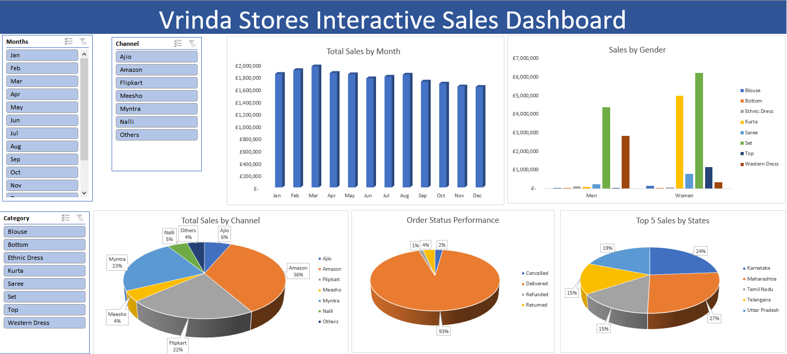
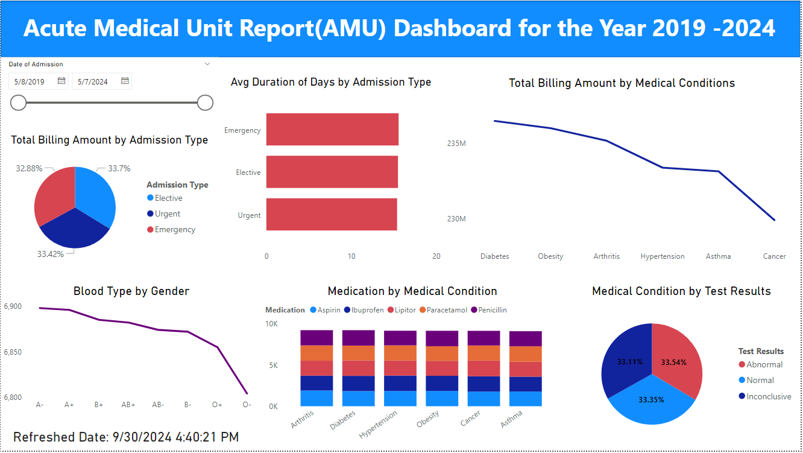
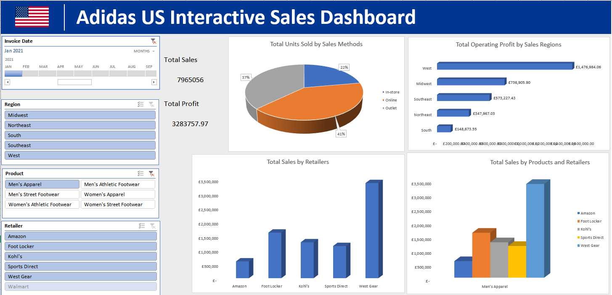

# Different Projects
# Project 1
**Title:** [Vrinda Store Interactive Dashboard](https://github.com/Dammie18/Dammie18.github.io/blob/main/Virinda%20StoreDB.xlsx)
 
**Tools Used:** Microsoft Excel (Pivot Chart, Pivot tables, Conditional formating, filters, slicers, timelines)
 
**Project Description:** This is an interactive Sales Dashboard that provides information on the order and sales by month this gives us the total sales made in each month, sales based on gender either men or women and also grouped by the product category providing us with which category of product gives the highest sales, order status performance(the state of products being cancelled, delivered, refunded or returned and from the dashboard we could see that 93% of the products were delivered giving us the highest sales), the order channel and the top 5 sales by states.
 
**Key findings:** From the dashboard the top 5 sales made about 50% of our total sales.
 
**Dashboard Overview:**

# Project 2
**Title:** Employee Records Cleansing
 
**SQL Code:** [SQL Queries](https://github.com/Dammie18/Dammie18.github.io/blob/main/Employee_data.sql)
 
**SQL Skills Used:** Different DDL statements are used such as the CREATE TABLE, INSERT INTO
 
**Project Description:** This code consists of two tables the Employee_Details table showing the EmpId, FullName, ManagerId, DateOfJoining, City and the Employee_Salary showing the EmpId, Project, Salary and Variable. Each table were created into the database using the CREATE TABLE statement and records were saved into the tables using the INSERT INTO statement. Different DDL statements, aggregate functions and Operators were used to write the codes to fetch the EmpId and FullName of all the employees working under the Manager with id – ‘986’, to fetch the different projects available from the EmployeeSalary table, to fetch the count of employees working in project ‘P1’, to find the maximum, minimum, and average salary of the employees, to find the employee id whose salary lies in the range of 9000 and 15000, to fetch all the employees who either live in California or work under a manager with ManagerId – 321, to fetch all those employees who work on Projects other than P1, to display the total salary of each employee adding the Salary with Variable value, to fetch the employees whose name begins with any two characters, followed by a text “hn” and ends with any sequence of characters and this was achieved using the WILDCARD CHARACTER, and to fetch all the EmpIds which are present in either of the tables – ‘EmployeeDetails’ and ‘EmployeeSalary’.
 
**Technology used:** SQL server, Visual Studio

# Project 3
 
**Title:** [DamZeal Retail Store Interactive Dashboard](https://github.com/Dammie18/Dammie18.github.io/blob/main/Retail_salesDB.xlsx)
 
**Tools Used:** Microsoft Excel (Pivot Chart, Pivot tables, Conditional formating, filters, slicers, timelines)
 
**Project Description:** This is a retail store interactive dashboard that provides information on the sales by year, sales by product, marketing spending on products, the effect of Holiday on stores and the top 5 stores by sales. The dashboard consists of 2 slicers, one for the product category and the other for all the store locations. It also has a timeline which helps to view the periods either yearly, quarterly, monthly or daily.
The raw data was gotten from Kaggle and was cleaned to remove duplicate rows. Pivot table was used to create the dashboard which makes it interactive, readable and easy to understand.
 
**Key findings:** From the dashboard the highest sales was generated in December 2023.
 
**Dashboard Overview:**

# Project 4
 
**Title:** [HR Dashboard Full Insight](https://github.com/Dammie18/Dammie18.github.io/blob/main/HR%20Analytics.pbix)
 
**Tools Used:** PowerBi (slicers, barchart, pie chart, line chart, new column to create the refereshed date, textbox, shapes), DAX Measures and Functions.
 
**Project Description:** This is an HR interactive dashboard that provides full insight on the Total Employees, total male employees and their percentage, total female employees and their percentage, employees due for promotion and those not due for promotion with their percentages, total number of employees with their service years, numbers of employees about to retire and the active workers, different levels of employees and their total number, and information of employees based on their distance from the office and more than 60% live very close to work.

**Key findings:** The dashboard provides insight on the total Employees, total male employees and their percentage, total female employees and their percentage, employees due for promotion and those not due for promotion with their percentages, total number of employees with their service years, numbers of employees about to retire and the active workers, different levels of employees and their total number, and information of employees based on their distance from the office and more than 60% live very close to work.
Also, different DAX measures were used to calculate the figures so as to make it interactive and different functions were also used such as the COUNT, COUNTX, FILTER, DIVIDE. 
 
**Dashboard Overview:**

# Project 5

**Title:** Employee Information Cleansing
 
**SQL Code:** [SQL Queries](https://github.com/Dammie18/Dammie18.github.io/blob/main/Employee_info.sql)
 
**SQL Skills Used:** Different DDL statements are used such as the CREATE TABLE, INSERT INTO JOIN statement
 
**Project Description:** This code consists of two tables the Employee Info table which shows the EmpID, EmpFname, EmpLname, Department, Project, Address, DOB, Gender and the Employee Position which shows the EmpID, EmpPosition, DateOfJoining, Salary. Each table were created into the database using the CREATE TABLE statement and records were saved into the tables using the INSERT INTO statement. Different DDL statements, aggregate functions and Operators were used to write the codes. Also the table has a PRIMARY KEY which was used to joined the two tables together to view all the records in both table.
 
**Technology used:** SQL server, Visual Studio

# Project 6
 
**Title:** [Acute Medical Unit Report(AMU) for the Year 2019-2024 Interactive Dashboard](https://github.com/Dammie18/Dammie18.github.io/blob/main/AMU%20Report%20and%20ConditionDB.pbix)
 
**Tools Used:** PowerBi (slicers, barchart, pie chart, line chart, new column to create the refereshed date, textbox, shapes)
 
**Project Description:** This is an Acute Medical Unit (AMU) Report Interactive Dashboard for the Year 2019-2024. The dataset consists of detail information of patients Name, Age, Gender, Blood Type, Medical Condition, Date of Admission, Doctor, Hospital, Insurance Provider, Billing Amount, Room Number, Admission Type, Discharge Date, Medication, Test Results.
The dataset was cleaned to remove duplicates information and empty rows were also removed. Also a new column was created called the Duration of Stay(Days) which was calculated by subtracting the Date of Admission from the Discharge Date to determine the number of Days spent in the hospital.
 
**Key findings:** This dashboard provides insights on Average Duration of Days spent in the hospital by the admission type, the total billing amount by different medical conditions. Also the Total billing amount by admission type and we saw that elective admission type has the highest of 33.7%. Also, the dashboard provides information on medications used to treat different conditions, the blood type by Gender and the different medical conditions with respect to the test result. The dashboard also consists of a slicer used to get information based on the date of admission between the year 2019-2024.
 
**Dashboard Overview:**

# Project 7
 
**Title:** [Adidas US Interactive Sales Dashboard](https://github.com/Dammie18/Dammie18.github.io/blob/main/My%20Practice%20Adidas-Dashboard-START.xlsx)
 
**Tools Used:** Microsoft Excel (Pivot Chart, Pivot tables, Conditional formating, filters, slicers, timelines)
 
**Project Description:** This is an Adidas US Interactive Sales Dashboard that provides information on all the retailers with their total sales i.e how much revenue each retailers made, the sales methods (in-store, online and outlet) with the total quantity sold for each method and this shows which of the sales method yielded more sales and the volume of sales across each method, also the region with respective to their operating profit i.e how much profit are made in each region, the sales trend showing how each products are performing across each retailers.
 
**Key findings:** The dashboard also shows the total sales of Seven million nine hundred and sixty-five thousand and fifty-six pounds (£7,965,056) generated by the company and the total profit earned of three million two hundred and eighty-three thousand, seven hundred and fifty-seven pounds, ninety-seven pence (£3,283,757.97).
 
**Dashboard Overview:**

# Project 8
**Title:** Football Players Data Cleansing
 
**SQL Code:** [SQL Queries](https://github.com/Dammie18/Dammie18.github.io/blob/main/FootballPlayers_data.sql)
 
**SQL Skills Used:** Different DDL statements are used such as the CREATE TABLE, INSERT INTO JOIN statement
 
**Project Description:** This code consists of a table which shows the Year, Team, NAME, No., Pos, Ht, Wt, Age, Exp, College, FirstName, LastName, Ft, In, Inches. This table was imported into SQL using the ETL, SSIS process via the Visual Studio and this makes the table automated and when new changes or updates are being made to the table, it reflects in the database.
Different DDL statements, aggregate functions and Operators were used to write the codes that determines each player by Team, Position, Height, Age, College, Missing age, Experience, weight, Tallest Player, Average Height of the player, Shortest player, Rank by POSITION. Some windows function such as RANK, OVER, PARTITION BY were also used in this code.

**Technology used:** SQL server, Visual Studio

# Project 9
 
**Title:** [DamZeal Cookies Financial Report Interactive Dashboard 2019/2020](https://github.com/Dammie18/Dammie18.github.io/blob/main/Cookies.pbix)
 
**Tools Used:** PowerBi (slicers, barchart, pie chart, line chart, new column to create the refereshed date, textbox, shapes)
 
**Project Description:** This is an interactive financial report dashboard on different products for the year 2019/2020 for 5 different countries; Canada, France, Germany, Mexico and United States
The dataset provides details of the Country, Product, Units Sold, Revenue per cookie, Cost per cookie, Revenue, Cost, Profit, Date, Month, Number, Month Name and Year.

**Key findings:** The dashboard provides insight on the Total profit and Total Revenue generated which are 2.76M and 4.69M respectively. Cards were used to generate these figures. Also the dashboard provides information on the total profit by product, total operating cost by month, total revenue by country.
The dashboard consists of two slicers for the Date and different products and also a refreshed date to determine how updated and recent the dashboard insights are.
 
**Dashboard Overview:**

